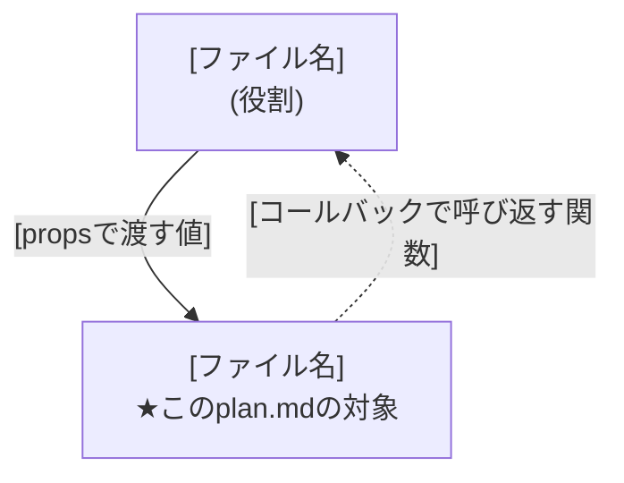

# Implementation Plan: [SCREEN NAME]

**Feature**: [###-feature-name](../../spec.md) | **Screen**: `[screen-id]` | **Date**: [DATE]

**Input**: Screen specification from `specs/[###-feature-name]/screens/[screen-id]/spec.md`

**Note**: This template is filled in by the `/speckit-plan` command, once per screen
(`specs/<feature>/screens/<screen-id>/plan.md`). A feature with no screens keeps a single
feature-root `plan.md` instead — see `docs/adr/0006-per-screen-implementation-plans.md`.

## 登場するコンポーネントと関係

<!--
  ACTION REQUIRED:
  - この画面のコンポーネントが、他の画面のコンポーネントと親を共有する・状態を
    共有する・propsやコールバックをやり取りするなど、単独で完結しない場合は必ず書く。
    完全に独立したコンポーネント1つだけで完結する画面では、このセクションごと省略する。
  - 表は「ファイル名だけ書いて役割の説明がない」状態を避けるためのもの。関係する
    ファイルを1行1つ、先に役割から説明してから図を出す。
-->

| ファイル | 役割 |
|---|---|
| `[ファイル名]` | [役割。この画面のコンポーネントには ★このplan.mdの対象 と付記する] |

実線 = 親から子へpropsで渡す。破線 = 子が親のコールバックを呼んで結果を伝える。

## Summary

[この画面固有の実装方針: 担当するコンポーネント、呼び出すBFFエンドポイント、状態管理の要点]

## Technical Context

<!--
  ACTION REQUIRED:
  - アプリ全体に共通する技術スタック・依存関係・デプロイ先・テスト基盤・永続化方式・
    リポジトリレイアウト・共通制約は docs/architecture.md に既に記載されている。
    ここに重複して書かず、下の行の参照のみを残す。
  - このセクションに書くのは、この画面固有の情報のみ。該当する固有情報が無いフィールドは
    行ごと省略する(空欄や「N/A」を残さない)。
-->

**共通のアーキテクチャ**: [docs/architecture.md](../../../../docs/architecture.md) を参照。

**Performance Goals**: [この画面固有の性能目標があれば記載。無ければ本行ごと省略]

**Constraints**: [docs/architecture.mdの制約に加えて、この画面固有の追加制約があれば記載。無ければ本行ごと省略]

**Scale/Scope**: [この画面固有の規模があれば記載。無ければ本行ごと省略]

## Constitution Check

<!--
  ACTION REQUIRED:
  - 共通インフラ(src/lib/backend.tsのswap point、BFF-onlyアクセス、globalThisキャッシュの
    非永続化)によって画面を問わず自動的に満たされる原則は、原則の説明を再掲せず1行に
    まとめる。
  - この画面固有の判断が必要な原則(呼び出すエンドポイント、この画面のスコープ外にした
    機能など)だけを個別に記載する。
-->

[Gates determined based on constitution file]

## Component Design

**担当コンポーネント**: [この画面を実装する具体的なコンポーネントファイル]

**呼び出すBFFエンドポイント**: [spec.mdの処理仕様表に挙げたエンドポイント。詳細は
openapi/bff/openapi.yamlを参照し、ここでは再掲しない]

**Structure Decision**: [このコンポーネントが置かれるパス、他画面のコンポーネントとの関係]

## Complexity Tracking

> **Fill ONLY if Constitution Check has violations that must be justified**

| Violation | Why Needed | Simpler Alternative Rejected Because |
|-----------|------------|---------------------------------------|
| [e.g., 4th project] | [current need] | [why 3 projects insufficient] |
| [e.g., Repository pattern] | [specific problem] | [why direct DB access insufficient] |
