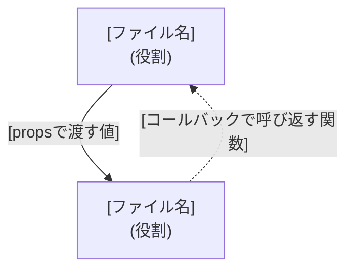

# Implementation Plan: [FEATURE]

**Branch**: `[###-feature-name]` | **Date**: [DATE] | **Spec**: [link]

**Input**: Feature specification from `specs/[###-feature-name]/spec.md`

**Note**: This template is filled in by the `/speckit-plan` command, once per feature
(`specs/<feature>/plan.md`), even when the feature has multiple screens — see
`docs/adr/0007-revert-to-feature-level-plan-md.md` for why a per-screen split was tried
and reverted.

## 登場するコンポーネントと関係

<!--
  ACTION REQUIRED:
  - この機能の複数の画面が親コンポーネントを共有する・状態を共有する・propsや
    コールバックをやり取りするなど、単独で完結しないコンポーネントがある場合は必ず書く。
    画面ごとに完全に独立したコンポーネントで完結する機能では、このセクションごと省略する。
  - 表は「ファイル名だけ書いて役割の説明がない」状態を避けるためのもの。関係する
    ファイルを1行1つ、先に役割から説明してから図を出す。
-->

| ファイル | 役割 |
|---|---|
| `[ファイル名]` | [役割] |



実線 = 親から子へpropsで渡す。破線 = 子が親のコールバックを呼んで結果を伝える。

## Summary

[Extract from feature spec: primary requirement + technical approach]

## Technical Context

<!--
  ACTION REQUIRED:
  - アプリ全体に共通する技術スタック・依存関係・デプロイ先・テスト基盤・永続化方式・
    リポジトリレイアウト・共通制約は docs/architecture.md に既に記載されている。
    ここに重複して書かず、下の行の参照のみを残す。docs/architecture.md自体に
    変更が必要な技術判断が生じた場合は、この機能のplan.mdではなくdocs/architecture.md
    を直接更新すること。
  - このセクションに書くのは、この機能固有の情報のみ。他の機能と共通しない値だけを
    埋める。該当する固有情報が無いフィールドは行ごと省略する(空欄や「N/A」を残さない)。
-->

**共通のアーキテクチャ**: [docs/architecture.md](../../docs/architecture.md) を参照。

**Performance Goals**: [この機能固有の性能目標があれば記載。無ければ本行ごと省略]

**Constraints**: [docs/architecture.mdの制約に加えて、この機能固有の追加制約があれば記載。無ければ本行ごと省略]

**Scale/Scope**: [この機能固有の規模。例: 画面数、エンティティ数]

## Constitution Check

<!--
  ACTION REQUIRED:
  - 共通インフラ(src/lib/backend.tsのswap point、BFF-onlyアクセス、globalThisキャッシュの
    非永続化)によって画面を問わず自動的に満たされる原則は、原則の説明を再掲せず1行に
    まとめる。
  - この機能固有の判断が必要な原則(各画面が呼ぶエンドポイント、この機能のスコープ外に
    した機能など)だけを個別に記載する。
-->

[Gates determined based on constitution file]

## Project Structure

### Source Code (この機能が追加/変更するパスのみ)

<!--
  ACTION REQUIRED: docs/architecture.md のリポジトリレイアウトに既に載っている共通パス
  (src/lib/backend.ts, src/lib/mock-*.ts, openapi/** など)は再掲しない。この機能が
  新規に追加する、または変更する具体的なファイルパスのみを列挙する。
-->

```text
[この機能が追加/変更する具体的なファイルパス]
```

**Structure Decision**: [Document the selected structure and reference the real
directories captured above; for shared/common paths, reference docs/architecture.md
instead of restating them]

## Complexity Tracking

> **Fill ONLY if Constitution Check has violations that must be justified**

| Violation | Why Needed | Simpler Alternative Rejected Because |
|-----------|------------|-------------------------------------|
| [e.g., 4th project] | [current need] | [why 3 projects insufficient] |
| [e.g., Repository pattern] | [specific problem] | [why direct DB access insufficient] |
