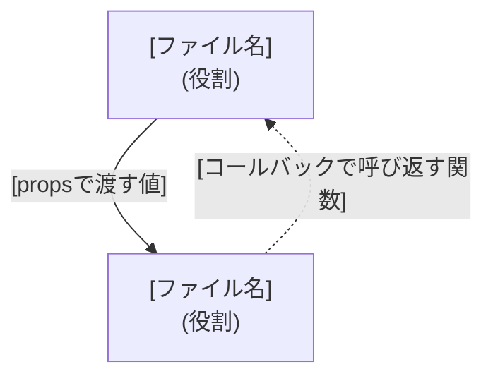

# Implementation Plan: [FEATURE]

**Branch**: `[###-feature-name]` | **Date**: [DATE] | **Spec**: [link]

**Input**: Feature specification from `specs/[###-feature-name]/spec.md`

**Note**: This template is filled in by the `/speckit-plan` command, once per feature
(`specs/<feature>/plan.md`), even when the feature has multiple screens. `plan.md` holds
exactly the two sections below — no Summary, Technical Context, Constitution Check, or
Complexity Tracking — see `docs/adr/0008-minimal-plan-md-sections.md`.

## 登場するコンポーネントと関係

<!--
  ACTION REQUIRED:
  - この機能の複数の画面が親コンポーネントを共有する・状態を共有する・propsや
    コールバックをやり取りするなど、単独で完結しないコンポーネントがある場合は必ず書く。
    画面ごとに完全に独立したコンポーネントで完結する機能では、このセクションごと省略する。
  - まず図で全体像を示し、そのあとに各コンポーネントの詳細をまとめる。
    ファイル名だけ書いて役割の説明がない状態を避けるため、各コンポーネントの見出しの
    直後に必ず役割から書く。
  - 各コンポーネントの詳細に、この機能の新規コンポーネントではない外部の関数
    (`src/lib/backend.ts`の`getTodos()`等、docs/architecture.mdの共通インフラ)を
    呼ぶ記述をする場合は、必ずどのファイルの関数かを明記する。ファイル名だけ書かれた
    図中のノードと区別がつかなくなるため、「新規実装ではない、既存の関数」であることも
    分かるようにする。
-->



実線 = 親から子へpropsで渡す。破線 = 子が親のコールバックを呼んで結果を伝える。

### `[ファイル名]`

役割: [1行で]

[Props/State/呼び出すAPIなど、この図だけでは分からない詳細]

### `[ファイル名]`

役割: [1行で]

[Props/State/呼び出すAPIなど、この図だけでは分からない詳細]

## Project Structure

### Source Code (この機能が追加/変更するパスのみ)

<!--
  ACTION REQUIRED: docs/architecture.md のリポジトリレイアウトに既に載っている共通パス
  (src/lib/backend.ts, src/lib/mock-*.ts, openapi/** など)は再掲しない。この機能が
  新規に追加する、または変更する具体的なファイルパスのみを列挙する。
-->

```text
[この機能が追加/変更する具体的なファイルパス]
```

**Structure Decision**: [Document the selected structure and reference the real
directories captured above; for shared/common paths, reference docs/architecture.md
instead of restating them]
