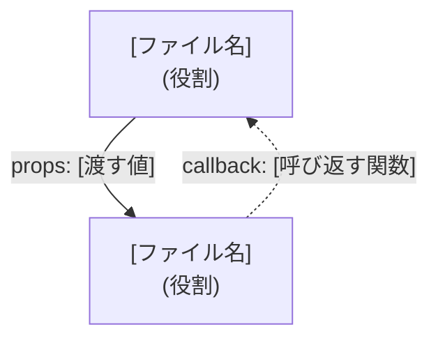

# Implementation Plan: [FEATURE]

**Branch**: `[###-feature-name]` | **Date**: [DATE] | **Spec**: [link]

**Input**: Design documents from `doc/フロントエンド設計書/[業務]/`

**Note**: This template is filled in by the `/speckit-plan` command, once per business/feature
(`doc/フロントエンド設計書/<業務>/詳細設計書.md`), even when the feature has multiple screens.
詳細設計書 holds exactly the two sections below — no Summary, Technical Context, Constitution
Check, or Complexity Tracking — see `doc/common/adr/0008-minimal-plan-md-sections.md`.

## 登場するコンポーネントと関係

<!--
  ACTION REQUIRED:
  - スコープはReactコンポーネントだけでなく、この機能が新規に書く/変更するBFFの
    Route Handler(src/app/api/**)も含む。Route Handlerは「ファイルパスと1行コメント」
    だけで済ませない — 他のコンポーネントと同じ扱いで、図のノードと詳細サブセクション
    (役割・呼び出すbackend.ts関数)を必ず持たせる。ここで設計しないと、BFF層に
    実装計画が無いままコードだけ書かれることになる。
  - この機能の複数のファイルが親コンポーネントを共有する・状態を共有する・propsや
    コールバックをやり取りする・HTTPで呼び合うなど、単独で完結しない関係がある場合は
    必ず書く。全ファイルが完全に独立して完結する機能では、このセクションごと省略する。
  - まず図で全体像を示し、そのあとに各ファイルの詳細をまとめる。ファイル名だけ書いて
    役割の説明がない状態を避けるため、各見出しの直後に必ず役割から書く。
  - 矢印の意味は凡例に頼らず、ラベル自体に埋め込む(例: "props: ...", "callback: ...",
    "fetch: METHOD /path")。読み手が実線/破線の意味を覚えている前提を作らない。
  - 各ファイルの詳細に、この機能の新規ファイルではない外部の関数
    (`src/lib/backend.ts`の`getTodos()`等)を呼ぶ記述をする場合は、必ずどのファイルの
    関数かを明記する。ファイル名だけ書かれた図中のノードと区別がつかなくなるため、
    その関数自体がこの機能で新規に追加されたものか、既存かも分かるようにする
    (Project Structureの「パターンと個別の中身」の区別を参照)。
-->



### `[ファイル名]`

役割: [1行で]

[Props/State/呼び出すAPIなど、この図だけでは分からない詳細]

### `[ファイル名]`

役割: [1行で]

[Props/State/呼び出すAPIなど、この図だけでは分からない詳細]

## Project Structure

### Source Code (この機能が追加/変更するパスのみ)

<!--
  ACTION REQUIRED: doc/common/AP方式設計書(フロントエンド編).md / doc/common/AP方式設計書(バックエンド編).md が「共通」として記載しているのはパターン
  (backend.tsに全エンティティのswap point関数が集約される構成、mock-<entity>.tsという
  命名規則)であり、個別の中身ではない。「backend.ts」「mock-*.ts」というファイル名の
  形だけを見て省略しない — この機能が新しいエンティティを導入するなら、backend.ts内に
  追加する具体的な関数名(変更として)と、新規に作る具体的なmock-<entity>.tsファイル
  (新規追加として)を必ず列挙する。省略してよいのは、他の機能が既に導入済みの
  エンティティに対する処理(swap pointの分岐ロジックそのもの等)だけ。それ以外の、この
  機能が新規に追加する、または変更する具体的なファイルパスも列挙する。
-->

```text
[この機能が追加/変更する具体的なファイルパス]
```

**Structure Decision**: [Document the selected structure and reference the real
directories captured above; for shared/common paths, reference doc/common/AP方式設計書(フロントエンド編).md / doc/common/AP方式設計書(バックエンド編).md
instead of restating them]
