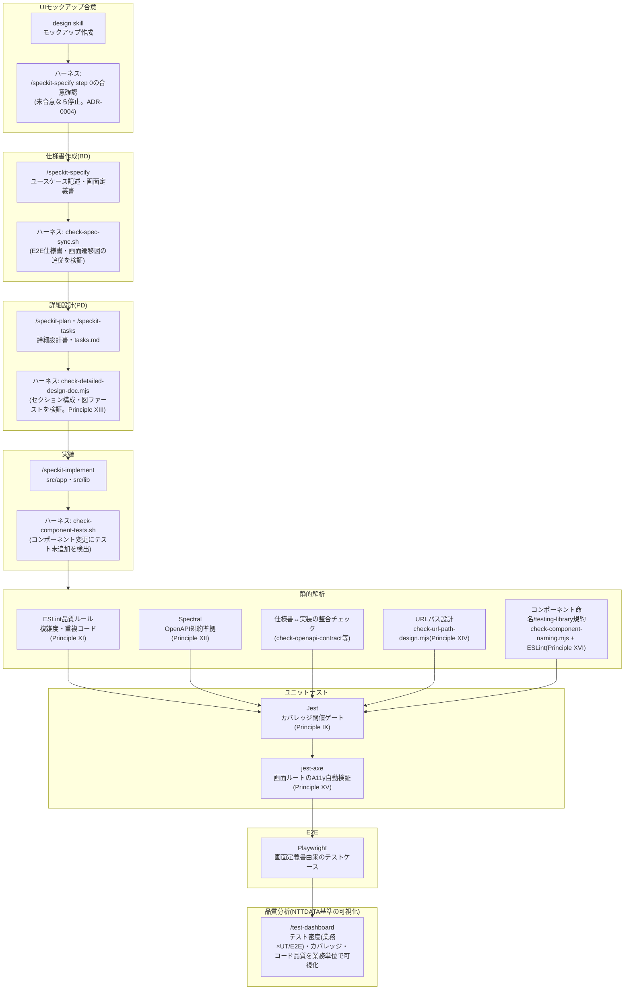
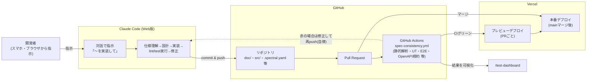

# 開発サイクル図: Claude Code (Web版) × GitHub × Vercel

**最終更新**: 2026-09-01

Claude Code Web版・GitHub・Vercelを連携させることで、「UIモックアップ合意→仕様書作成(BD)→
詳細設計(PD)→実装→静的解析→ユニットテスト→E2E→品質分析」のサイクルをほぼ自動で回し、
結果を可視化できる。ブラウザ(スマホ含む)からClaude Codeに指示を出すだけで開発が進むため、
オフィスのPCに縛られない開発スタイルが成立する。

このドキュメントはその仕組みを図で説明したものであり、各ゲートの詳細な条件は
`.specify/memory/constitution.md`(Core Principle群)と各ADR
(`doc/common/adr/**`)を正とする。

## 1. 開発サイクル(モックアップ合意→BD→PD→実装→品質分析)

このプロジェクトでは、下図の各工程がspec-kitのSkill・CIゲート・ダッシュボードと
1対1で対応している。画面を持つ機能は、仕様書を書き始める前に必ずモックアップで
ユーザとプロダクトの要件・見た目を合意する(doc/common/adr/0004-mockup-first-requirements.md)。

## 2. インフラ連携(Claude Code Web版 × GitHub × Vercel)

「ベッドで指示を出すだけ」を成立させているのは、Claude Code Web版がGitHub上の
ブランチに直接コミット・プッシュし、GitHub ActionsがCIゲートを機械的に実行し、
Vercelが結果をデプロイまで自動でつなぐ構成である。

## 3. ポイント

- **「ハーネス」は成果物を検証しCIをブロックする機構を指す**: 各工程を表す
  `/speckit-specify`・`design`skillのようなSkill名は成果物を*生成*する側であり、
  それ自体はハーネスではない。ハーネスは`check-spec-sync.sh`・
  `check-detailed-design-doc.mjs`・`check-component-tests.sh`・ESLint・Spectral・
  Jestカバレッジ閾値・Playwright・`check-openapi-contract`等、成果物を検証して
  違反があればマージを止める機構のみを指す(ADR-0023)。
- **仕様書化の前にモックアップ合意**: 画面を持つ新機能は、`design`skillで作成した
  モックアップの視覚的合意を得るまで`/speckit-specify`が仕様書生成に進まない
  (doc/common/adr/0004-mockup-first-requirements.md)。自然言語の説明だけでは
  画面の見た目・外形的な機能性の解釈がぶれやすいため。既存の2画面
  (Todo一覧・Todo新規登録)は遡及的にモックアップを作成し、公開デモとして誰でも
  見られるよう`/mockup`にも静的公開している。
- **場所を選ばない**: Claude Code Web版はブラウザ(スマホ)から使えるため、
  開発者はPCの前にいなくても自然言語で指示を出すだけで良い。
- **ゲートは即時ブロック**: 静的解析・ユニットテストカバレッジ・E2E・OpenAPI規約は
  すべて`spec-consistency.yml`のCIジョブとしてPRごとに実行され、違反があれば
  マージ不可になる(閾値を緩めて回避するのではなく、実装側を直す運用)。
- **品質はNTTDATA用語で可視化**: テスト密度(テスト件数÷step数(Ks))を含む
  品質指標を業務単位のマトリクス表として`/test-dashboard`に表示し、CIログを
  読まなくても品質状況を一目で確認できる。
- **各ゲートの背景**: なぜそのゲートを追加したか・何を意図的に対象外としたかは
  `doc/common/adr/`配下の各ADRと、対応する`constitution.md`のCore Principleに
  記録されている。
- **プロジェクト全体の方針決定も受け入れ基準にする**: 対応ブラウザ・国際化対応・
  ダークモードの状態保持・OGP方針のように、機能ごとではなくプロジェクト全体で
  一度だけ決めればよい方針は、`doc/common/AP方式設計書(フロントエンド編).md`の
  「非機能方針」節に決定を記録し、`check-frontend-nonfunctional-policy.mjs`
  (`frontend-nonfunctional-policy`ジョブ)がプレースホルダのまま放置されていない
  かをPRごとに検証する。値そのものの正しさではなく、決定が記録されているかだけを
  見る受け入れ基準である(Principle XVII、ADR-0024)。
- **ハーネス化しない項目はガイドに記載する**: 単一の正解を機械的に判定できない、
  またはプロジェクトの意図的な既存判断と単純比較すると誤検知になる項目は、
  `doc/common/フロントエンド設計ガイド.md`に「熟慮を促す観点」として記載し、
  CIやレビューでの機械的な合否判定の対象にはしない(ADR-0024)。
