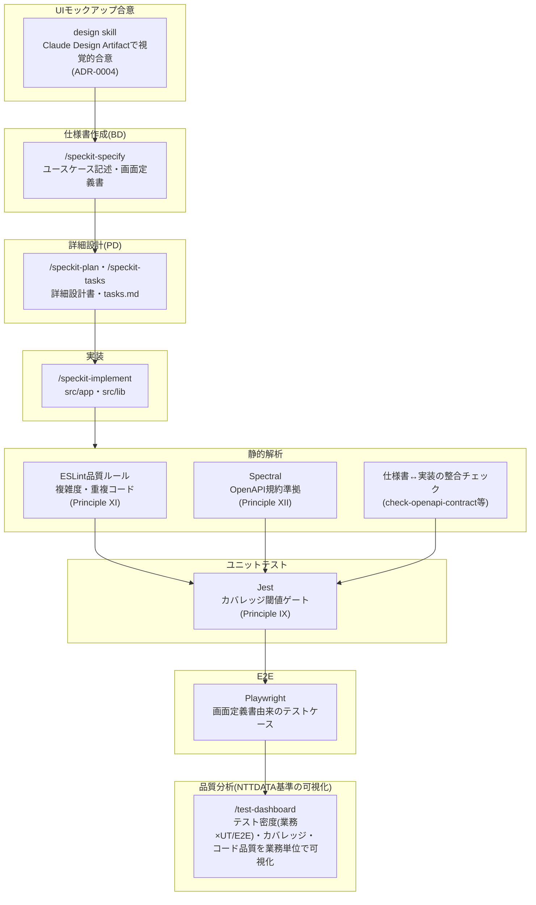
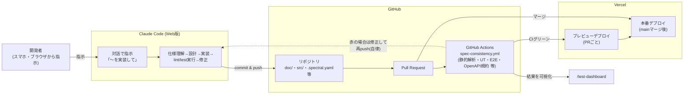

# 開発サイクル図: Claude Code (Web版) × GitHub × Vercel

**最終更新**: 2026-08-31

Claude Code Web版・GitHub・Vercelを連携させることで、「UIモックアップ合意→仕様書作成(BD)→
詳細設計(PD)→実装→静的解析→ユニットテスト→E2E→品質分析」のサイクルをほぼ自動で回し、
結果を可視化できる。ブラウザ(スマホ含む)からClaude Codeに指示を出すだけで開発が進むため、
オフィスのPCに縛られない開発スタイルが成立する。

このドキュメントはその仕組みを図で説明したものであり、各ゲートの詳細な条件は
`.specify/memory/constitution.md`(Core Principle群)と各ADR
(`doc/common/adr/**`)を正とする。

## 1. 開発サイクル(モックアップ合意→BD→PD→実装→品質分析)

このプロジェクトでは、下図の各工程がspec-kitのSkill・CIゲート・ダッシュボードと
1対1で対応している。画面を持つ機能は、仕様書を書き始める前に必ずモックアップで
ユーザとプロダクトの要件・見た目を合意する(doc/common/adr/0004-mockup-first-requirements.md)。

## 2. インフラ連携(Claude Code Web版 × GitHub × Vercel)

「ベッドで指示を出すだけ」を成立させているのは、Claude Code Web版がGitHub上の
ブランチに直接コミット・プッシュし、GitHub ActionsがCIゲートを機械的に実行し、
Vercelが結果をデプロイまで自動でつなぐ構成である。

## 3. ポイント

- **仕様書化の前にモックアップ合意**: 画面を持つ新機能は、`design`skillで作成した
  モックアップの視覚的合意を得るまで`/speckit-specify`が仕様書生成に進まない
  (doc/common/adr/0004-mockup-first-requirements.md)。自然言語の説明だけでは
  画面の見た目・外形的な機能性の解釈がぶれやすいため。既存の2画面
  (Todo一覧・Todo新規登録)は遡及的にモックアップを作成し、公開デモとして誰でも
  見られるよう`/mockup`にも静的公開している。
- **場所を選ばない**: Claude Code Web版はブラウザ(スマホ)から使えるため、
  開発者はPCの前にいなくても自然言語で指示を出すだけで良い。
- **ゲートは即時ブロック**: 静的解析・ユニットテストカバレッジ・E2E・OpenAPI規約は
  すべて`spec-consistency.yml`のCIジョブとしてPRごとに実行され、違反があれば
  マージ不可になる(閾値を緩めて回避するのではなく、実装側を直す運用)。
- **品質はNTTDATA用語で可視化**: テスト密度(テスト件数÷step数(Ks))を含む
  品質指標を業務単位のマトリクス表として`/test-dashboard`に表示し、CIログを
  読まなくても品質状況を一目で確認できる。
- **各ゲートの背景**: なぜそのゲートを追加したか・何を意図的に対象外としたかは
  `doc/common/adr/`配下の各ADRと、対応する`constitution.md`のCore Principleに
  記録されている。
