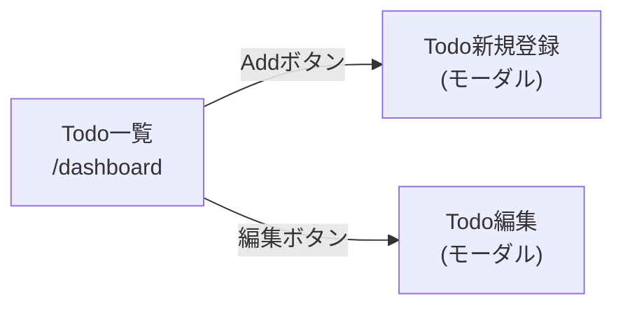

# 画面遷移図: Todoダッシュボード

**対象業務**: `業務1_Todoダッシュボード`

**最終更新**: 2026-09-01

このドキュメントは、各画面定義書の「処理仕様」内で各画面が自ら記述する遷移先から生成
したものであり、手作業で遷移元情報を追記する場所ではない。画面ごとの詳細仕様は各
ユースケース記述・画面定義書を参照すること。

## 遷移一覧

| 元画面 | 発火契機 | 先画面 | 根拠 |
|---|---|---|---|
| `todo-list` | Addボタンをクリック | `todo-new` | [画面定義書(Todo一覧) 処理仕様 #2](./画面定義書_Todo一覧.md#処理仕様) |
| `todo-list` | 編集ボタンをクリック | `todo-edit` | [画面定義書(Todo一覧) 処理仕様 #3](./画面定義書_Todo一覧.md#処理仕様) |
