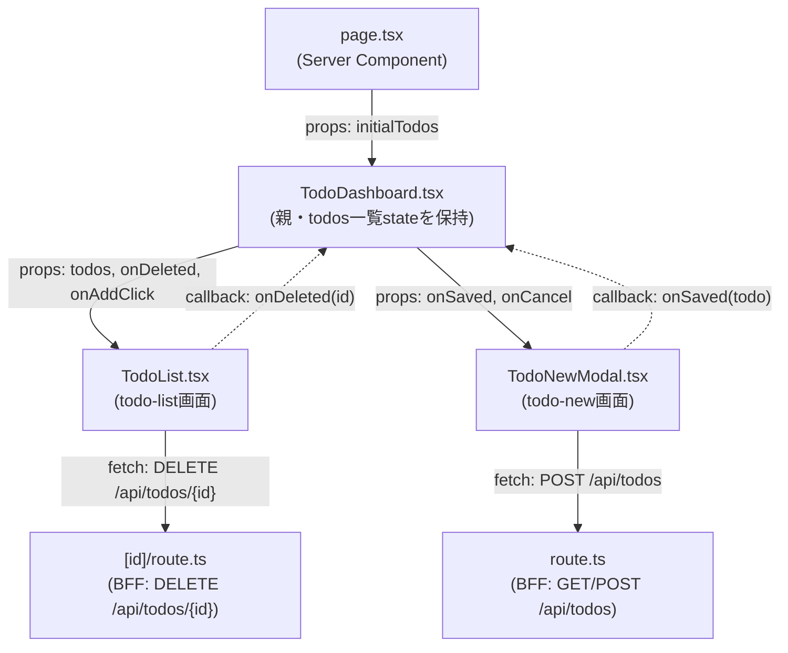

# Implementation Plan: Todoダッシュボード

**Branch**: `001-todo-dashboard` | **Date**: 2026-08-30 | **Spec**: [spec.md](./spec.md)

**Input**: Feature specification from `/specs/001-todo-dashboard/spec.md`

## 登場するコンポーネントと関係



(データそのものの書き換えは常に親`TodoDashboard.tsx`側で行う。BFFより先
(`src/lib/backend.ts`・`mock-todos.ts`)は下記Project Structureを参照)

### `page.tsx`

役割: 画面のエントリ(Server Component)。

`src/lib/backend.ts`の`getTodos()`(swap pointという既存ファイルに、この機能で追加する
関数。下記Project Structure参照)を呼んで初期データを取得し、`TodoDashboard`に
`initialTodos`として渡すだけ。自身は状態を持たない。

### `TodoDashboard.tsx`

役割: 親。`todos`一覧stateとモーダル開閉stateを持つ。

[todo-list](./screens/todo-list/spec.md)と[todo-new](./screens/todo-new/spec.md)の
両方が同じ一覧データに影響する(削除で減り、登録で増える)ため、どちらか一方の画面には
属させず、この親が保持する。`TodoList`から`onDeleted(id)`を受けたら`todos`からその1件を
除き、`TodoNewModal`から`onSaved(todo)`を受けたら`todos`に追加する。

### `TodoList.tsx`

役割: [todo-list](./screens/todo-list/spec.md)画面の実装。一覧描画と削除ボタンの処理を担当。

`todos`を描画するだけ(データ取得はこの画面の責務ではない)。削除は自身が
`DELETE /api/todos/{id}`を呼び、成功したら`onDeleted(id)`で親に伝える。`todos`配列
そのものの書き換えは行わない。

### `TodoNewModal.tsx`

役割: [todo-new](./screens/todo-new/spec.md)画面の実装。新規登録フォームを担当。

入力内容・バリデーション・保存中の表示・失敗メッセージはすべて自身が持つ。Saveボタン
押下時、`POST /api/todos`を呼ぶのも自身。保存成功後、一覧への追加は行わず
`onSaved(todo)`で親に通知するだけ。表示/非表示は親が持つ`isModalOpen`stateで制御される
(自身は開閉stateを持たない)。

### `route.ts` (`src/app/api/todos/route.ts`)

役割: BFFのRoute Handler。`GET /api/todos`・`POST /api/todos`を実装。

`GET`は`src/lib/backend.ts`の`getTodos()`をそのまま呼んで結果を返す。`POST`は
`title`・`dueDate`・`assignee`・`status`の必須項目チェックを行い(未入力または不正な
`status`なら400を返す)、通過したら`createTodo()`に渡し、作成されたTodoを返す(201)。
クライアント側の`TodoNewModal.tsx`も同じ必須項目チェックを行うが、これはUXのための
先行チェックであり、`route.ts`側の検証を代替するものではない。リクエスト/レスポンスの
詳細は[openapi/bff/openapi.yaml](../../openapi/bff/openapi.yaml)を参照。

### `[id]/route.ts` (`src/app/api/todos/[id]/route.ts`)

役割: BFFのRoute Handler。`DELETE /api/todos/{id}`を実装。

`src/lib/backend.ts`の`deleteTodo(id)`を呼ぶだけ。レスポンスコードの詳細は
[openapi/bff/openapi.yaml](../../openapi/bff/openapi.yaml)を参照。

## Project Structure

### Source Code (この機能が追加/変更するパス)

`backend.ts`がswap pointという1ファイルに集約される構成自体、および`mock-<entity>.ts`と
いう命名規則は[docs/architecture.md](../../docs/architecture.md)に記載の共通パターンで
あり、ここでは繰り返さない。ただし`backend.ts`内の個別の関数や個別の`mock-*.ts`ファイルは
共通インフラではなく、それを導入した機能自身の成果物であるため、以下に明記する
(docs/architecture.mdの「注意」参照)。

```text
src/app/
├── dashboard/
│   ├── page.tsx              # Todo一覧画面のエントリ
│   ├── TodoDashboard.tsx     # todos一覧state・モーダル開閉stateを保持する親
│   ├── TodoList.tsx          # todo-list画面: 一覧表示・削除
│   ├── TodoNewModal.tsx      # todo-new画面: 新規登録モーダル
│   └── dashboard.module.css
└── api/todos/
    ├── route.ts               # GET /api/todos, POST /api/todos
    └── [id]/route.ts          # DELETE /api/todos/{id}

src/lib/
├── backend.ts        # 変更: getTodos/createTodo/deleteTodoをこの機能で追加(既存ファイル)
└── mock-todos.ts      # 新規: この機能のインメモリモック(globalThisキャッシュ)

openapi/common/schemas/Todo.yaml  # 共有Todoスキーマ
```

**Structure Decision**: Next.js App Router単一プロジェクト内にfrontendとBFFが同居する構成
(docs/architecture.md参照)。画面ごとのコンポーネント(`TodoList.tsx`・`TodoNewModal.tsx`)は、
共有state(`todos`一覧・モーダル開閉)を持つ親(`TodoDashboard.tsx`)の子として実装する
(上図参照)。
