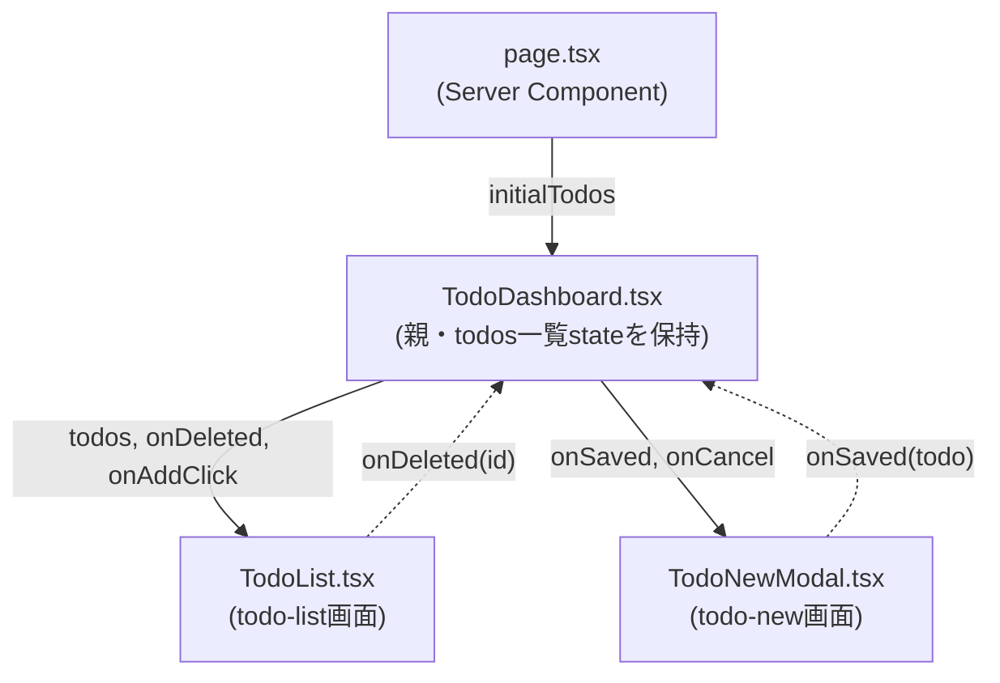

# Implementation Plan: Todoダッシュボード

**Branch**: `001-todo-dashboard` | **Date**: 2026-08-30 | **Spec**: [spec.md](./spec.md)

**Input**: Feature specification from `/specs/001-todo-dashboard/spec.md`

## 登場するコンポーネントと関係

| ファイル | 役割 |
|---|---|
| `page.tsx` | 画面のエントリ(Server Component)。`getTodos()`で初期データを取得するだけ |
| `TodoDashboard.tsx` | 親。`todos`一覧stateとモーダル開閉stateを持つ。[todo-list](./screens/todo-list/spec.md)と[todo-new](./screens/todo-new/spec.md)の両方が使うため、どちらか一方の画面には属さない |
| `TodoList.tsx` | [todo-list](./screens/todo-list/spec.md)画面の実装。一覧描画と削除ボタンの処理を担当 |
| `TodoNewModal.tsx` | [todo-new](./screens/todo-new/spec.md)画面の実装。新規登録フォームを担当 |



実線 = 親から子へpropsで渡す。破線 = 子が親のコールバックを呼んで結果を伝える
(データそのものの書き換えは常に親`TodoDashboard.tsx`側で行う)。

## Summary

Todo一覧画面(`/dashboard`)とTodo新規登録モーダルの2画面を実装する。ブラウザはこのアプリ自身の
`/api/todos` Route Handlerのみを呼び出す設計とし、`src/lib/backend.ts`が`BACKEND_API_URL`の有無で
モック(`mock-todos.ts`、`globalThis`キャッシュ)と実バックエンド(`backend-client.ts`経由)を
切り替える、既存のswap point(docs/architecture.md参照)をそのまま利用する。

- **[todo-list](./screens/todo-list/spec.md)(一覧表示・削除)**: `page.tsx`から渡された`todos`を
  描画するだけ。削除は`TodoList.tsx`自身が`DELETE /api/todos/{id}`を呼び、成功したら
  `onDeleted(id)`で親に伝える(上図参照)。
- **[todo-new](./screens/todo-new/spec.md)(新規登録)**: 入力内容・バリデーション・保存中の表示・
  失敗メッセージは`TodoNewModal.tsx`自身が持つ。Saveボタン押下時、`POST /api/todos`を呼ぶのも
  このコンポーネント自身。保存成功後、一覧に追加する処理は`TodoDashboard.tsx`が行う
  (`onSaved(todo)`で通知するだけ)。

## Technical Context

**共通のアーキテクチャ**: [docs/architecture.md](../../docs/architecture.md) を参照。

**Performance Goals**: 特筆すべき性能目標なし(サンプル/学習用途の規模)。

**Scale/Scope**: 画面2つ(Todo一覧、Todo新規登録)。エンティティ1つ(Todo)。

## Constitution Check

*GATE: Must pass before implementation. Re-check after implementation for drift.*

- **I・II・IV**: `docs/architecture.md`の共通インフラ(BFF-onlyアクセス、`backend.ts`のswap
  point、`globalThis`キャッシュの非永続化)により自動的に満たされる。追加対応は不要。
- **III. Contract-First APIs**: todo-listが呼ぶのは`GET /api/todos`(初期表示)・
  `DELETE /api/todos/{id}`(削除)。todo-newが呼ぶのは`POST /api/todos`(登録)。いずれも
  [openapi/bff/openapi.yaml](../../openapi/bff/openapi.yaml)に定義済み。共有スキーマ(Todo)は
  [openapi/common/schemas/Todo.yaml](../../openapi/common/schemas/Todo.yaml)を両方から`$ref`する。
- **V. Minimal, Scoped Implementation**: 認証・ページング・検索・下書き保存などspec.mdで
  要求されていない機能は実装しない。
- 違反なし。Complexity Trackingへの記載は不要。

## Project Structure

### Source Code (この機能が追加/変更するパス)

共通インフラ(`src/lib/backend.ts`・`backend-client.ts`・`mock-*.ts`・`openapi/**`)は
[docs/architecture.md](../../docs/architecture.md)のリポジトリレイアウトを参照。以下は
この機能固有のパスのみ。

```text
src/app/
├── dashboard/
│   ├── page.tsx              # Todo一覧画面のエントリ
│   ├── TodoDashboard.tsx     # todos一覧state・モーダル開閉stateを保持する親
│   ├── TodoList.tsx          # todo-list画面: 一覧表示・削除
│   ├── TodoNewModal.tsx      # todo-new画面: 新規登録モーダル
│   └── dashboard.module.css
└── api/todos/
    ├── route.ts               # GET /api/todos, POST /api/todos
    └── [id]/route.ts          # DELETE /api/todos/{id}

openapi/common/schemas/Todo.yaml  # 共有Todoスキーマ
```

**Structure Decision**: Next.js App Router単一プロジェクト内にfrontendとBFFが同居する構成
(docs/architecture.md参照)。画面ごとのコンポーネント(`TodoList.tsx`・`TodoNewModal.tsx`)は、
共有state(`todos`一覧・モーダル開閉)を持つ親(`TodoDashboard.tsx`)の子として実装する
(上図参照)。

## Complexity Tracking

*Constitution Checkに違反なし。本セクションは空欄。*
