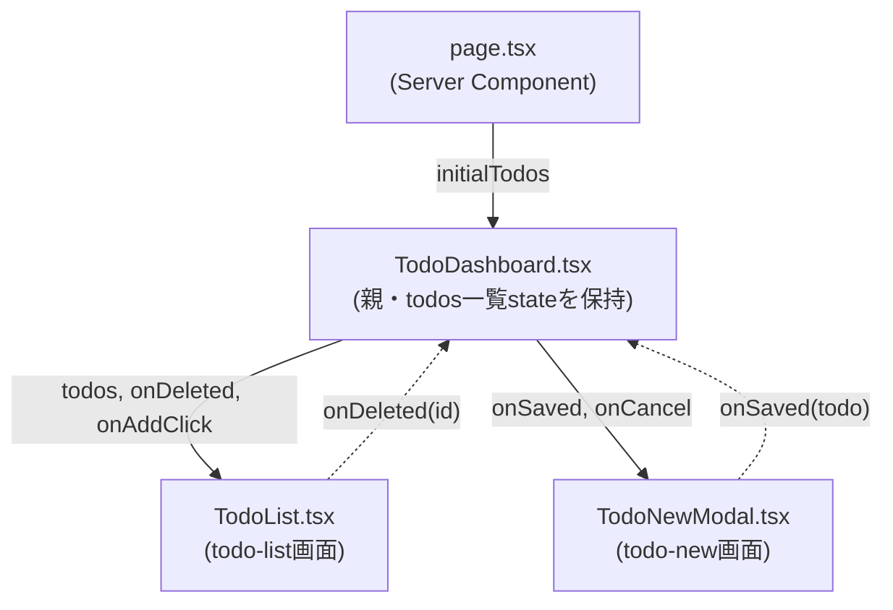

# Implementation Plan: Todoダッシュボード

**Branch**: `001-todo-dashboard` | **Date**: 2026-08-30 | **Spec**: [spec.md](./spec.md)

**Input**: Feature specification from `/specs/001-todo-dashboard/spec.md`

## 登場するコンポーネントと関係



実線 = 親から子へpropsで渡す。破線 = 子が親のコールバックを呼んで結果を伝える
(データそのものの書き換えは常に親`TodoDashboard.tsx`側で行う)。

### `page.tsx`

役割: 画面のエントリ(Server Component)。

[docs/architecture.md](../../docs/architecture.md)の共通インフラである`src/lib/backend.ts`
の`getTodos()`(新規実装ではない、既存の関数)を呼んで初期データを取得し、
`TodoDashboard`に`initialTodos`として渡すだけ。自身は状態を持たない。

### `TodoDashboard.tsx`

役割: 親。`todos`一覧stateとモーダル開閉stateを持つ。

[todo-list](./screens/todo-list/spec.md)と[todo-new](./screens/todo-new/spec.md)の
両方が同じ一覧データに影響する(削除で減り、登録で増える)ため、どちらか一方の画面には
属させず、この親が保持する。`TodoList`から`onDeleted(id)`を受けたら`todos`からその1件を
除き、`TodoNewModal`から`onSaved(todo)`を受けたら`todos`に追加する。

### `TodoList.tsx`

役割: [todo-list](./screens/todo-list/spec.md)画面の実装。一覧描画と削除ボタンの処理を担当。

`todos`を描画するだけ(データ取得はこの画面の責務ではない)。削除は自身が
`DELETE /api/todos/{id}`を呼び、成功したら`onDeleted(id)`で親に伝える。`todos`配列
そのものの書き換えは行わない。

### `TodoNewModal.tsx`

役割: [todo-new](./screens/todo-new/spec.md)画面の実装。新規登録フォームを担当。

入力内容・バリデーション・保存中の表示・失敗メッセージはすべて自身が持つ。Saveボタン
押下時、`POST /api/todos`を呼ぶのも自身。保存成功後、一覧への追加は行わず
`onSaved(todo)`で親に通知するだけ。表示/非表示は親が持つ`isModalOpen`stateで制御される
(自身は開閉stateを持たない)。

## Project Structure

### Source Code (この機能が追加/変更するパス)

共通インフラ(`src/lib/backend.ts`・`backend-client.ts`・`mock-*.ts`・`openapi/**`)は
[docs/architecture.md](../../docs/architecture.md)のリポジトリレイアウトを参照。以下は
この機能固有のパスのみ。

```text
src/app/
├── dashboard/
│   ├── page.tsx              # Todo一覧画面のエントリ
│   ├── TodoDashboard.tsx     # todos一覧state・モーダル開閉stateを保持する親
│   ├── TodoList.tsx          # todo-list画面: 一覧表示・削除
│   ├── TodoNewModal.tsx      # todo-new画面: 新規登録モーダル
│   └── dashboard.module.css
└── api/todos/
    ├── route.ts               # GET /api/todos, POST /api/todos
    └── [id]/route.ts          # DELETE /api/todos/{id}

openapi/common/schemas/Todo.yaml  # 共有Todoスキーマ
```

**Structure Decision**: Next.js App Router単一プロジェクト内にfrontendとBFFが同居する構成
(docs/architecture.md参照)。画面ごとのコンポーネント(`TodoList.tsx`・`TodoNewModal.tsx`)は、
共有state(`todos`一覧・モーダル開閉)を持つ親(`TodoDashboard.tsx`)の子として実装する
(上図参照)。
