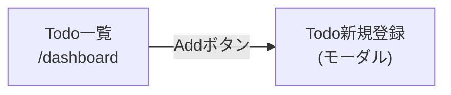

# 画面遷移図: Todoダッシュボード

**対象機能**: `001-todo-dashboard`

**最終更新**: 2026-08-29

このドキュメントは、`screens/*/spec.md` の「画面定義 > 処理仕様」内で各画面が自ら記述する
遷移先から生成したものであり、手作業で遷移元情報を追記する場所ではない。画面ごとの詳細
仕様は各`screens/<画面ID>/spec.md`を参照すること。

## 遷移一覧

| 元画面 | 発火契機 | 先画面 | 根拠 |
|---|---|---|---|
| `todo-list` | Addボタンをクリック | `todo-new` | [todo-list/spec.md 処理仕様 #2](screens/todo-list/spec.md#処理仕様) |
