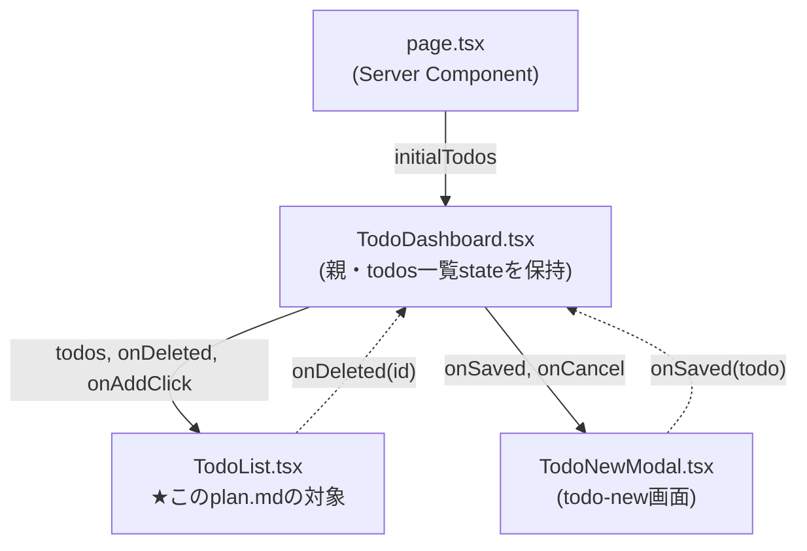

# Implementation Plan: Todo一覧

**Feature**: [001-todo-dashboard](../../spec.md) | **Screen**: `todo-list` | **Spec**: [spec.md](./spec.md)

**Input**: Screen specification from `specs/001-todo-dashboard/screens/todo-list/spec.md`

## 登場するコンポーネントと関係

| ファイル | 役割 |
|---|---|
| `page.tsx` | 画面のエントリ(Server Component)。`getTodos()`で初期データを取得するだけ |
| `TodoDashboard.tsx` | 親。`todos`一覧stateとモーダル開閉stateを持つ。**todo-listとtodo-newの両方が使う**ため、どちらか一方の画面には属さない |
| `TodoList.tsx` | ★このplan.mdが実装対象とする画面(todo-list)本体。一覧描画と削除ボタンの処理を担当 |
| `TodoNewModal.tsx` | [todo-new](../todo-new/spec.md)画面の実装(このplan.mdの対象外。参考として図に含める) |

実線 = 親から子へpropsで渡す。破線 = 子が親のコールバックを呼んで結果を伝える
(データそのものの書き換えは常に親`TodoDashboard.tsx`側で行う)。

## Summary

この画面(`todo-list`)が担当するのは一覧表示と削除の2つだけ。

- **一覧表示**: `page.tsx`から渡された`todos`を描画するだけ(データ取得はこの画面の
  責務ではない)。
- **削除**: `TodoList.tsx`自身が`DELETE /api/todos/{id}`を呼ぶ。成功したら
  `onDeleted(id)`で親に伝える(上図参照)。

## Technical Context

**共通のアーキテクチャ**: [docs/architecture.md](../../../../docs/architecture.md) を参照。

**Scale/Scope**: 一覧テーブル1つ、行あたりの操作は削除のみ。

## Constitution Check

- **I・II・IV**: `docs/architecture.md`の共通インフラ(BFF-onlyアクセス、
  `backend.ts`のswap point、`globalThis`キャッシュの非永続化)により自動的に満たされる。
  この画面固有の追加対応はない。
- **III. Contract-First APIs**: この画面が呼ぶのは`GET /api/todos`(初期表示、
  Server Component経由)と`DELETE /api/todos/{id}`(削除)。いずれも
  [openapi/bff/openapi.yaml](../../../../openapi/bff/openapi.yaml)に定義済み。
- **V. Minimal, Scoped Implementation**: ページング・検索・ソートはspec.mdで
  要求されていないため実装しない。

## Component Design

**担当コンポーネント**: `src/app/dashboard/TodoList.tsx`(新規)。エントリは
`src/app/dashboard/page.tsx`(Server Component、`getTodos()`で初期データ取得)。

**呼び出すBFFエンドポイント**: `GET /api/todos`(`page.tsx`経由)、
`DELETE /api/todos/{id}`(削除ボタン)。詳細は
[openapi/bff/openapi.yaml](../../../../openapi/bff/openapi.yaml)を参照。

**Structure Decision**: 上記の図の通り。`TodoList`自身は`todos`配列を書き換えない
(一覧描画・削除確認ダイアログの表示・`DELETE`リクエストの送信までが責務)。

## Complexity Tracking

*Constitution Checkに違反なし。本セクションは空欄。*
