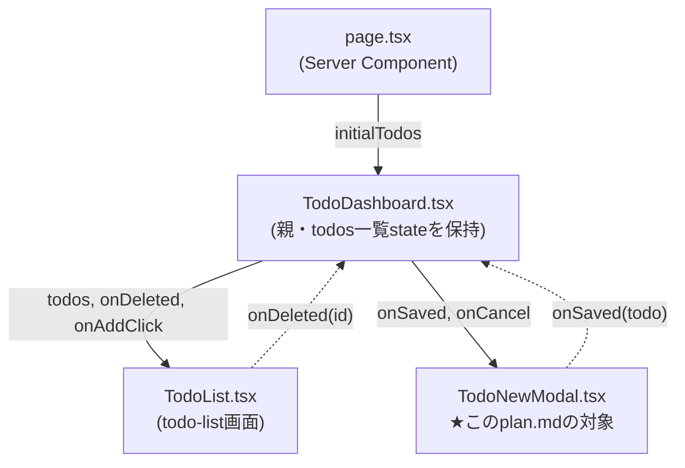

# Implementation Plan: Todo新規登録

**Feature**: [001-todo-dashboard](../../spec.md) | **Screen**: `todo-new` | **Spec**: [spec.md](./spec.md)

**Input**: Screen specification from `specs/001-todo-dashboard/screens/todo-new/spec.md`

## 登場するコンポーネントと関係

| ファイル | 役割 |
|---|---|
| `page.tsx` | 画面のエントリ(Server Component)。`getTodos()`で初期データを取得するだけ |
| `TodoDashboard.tsx` | 親。`todos`一覧stateとモーダル開閉stateを持つ。**todo-listとtodo-newの両方が使う**ため、どちらか一方の画面には属さない |
| `TodoList.tsx` | [todo-list](../todo-list/spec.md)画面の実装(このplan.mdの対象外。参考として図に含める) |
| `TodoNewModal.tsx` | ★このplan.mdが実装対象とする画面(todo-new)本体。新規登録フォームを担当 |

実線 = 親から子へpropsで渡す。破線 = 子が親のコールバックを呼んで結果を伝える
(データそのものの書き換えは常に親`TodoDashboard.tsx`側で行う)。

## Summary

[todo-list](../todo-list/spec.md)のAddボタンから開くモーダルとして`TodoNewModal.tsx`を
実装する。

- **入力〜保存**: 入力内容・バリデーション・保存中の表示・失敗メッセージは、すべて
  `TodoNewModal.tsx`自身が持つ。Saveボタン押下時、`POST /api/todos`を呼ぶのもこの
  コンポーネント自身。
- **保存成功後**: 新しいTodoを一覧に追加する処理は`TodoDashboard.tsx`が行う
  (`onSaved(todo)`で通知するだけ。上図参照)。

## Technical Context

**共通のアーキテクチャ**: [docs/architecture.md](../../../../docs/architecture.md) を参照。

**Scale/Scope**: 入力項目4つ(Todo名・期限・担当者・ステータス)。

## Constitution Check

- **I・II・IV**: `docs/architecture.md`の共通インフラ(BFF-onlyアクセス、
  `backend.ts`のswap point、`globalThis`キャッシュの非永続化)により自動的に満たされる。
  この画面固有の追加対応はない。
- **III. Contract-First APIs**: この画面が呼ぶのは`POST /api/todos`のみ。定義済み。
  詳細は[openapi/bff/openapi.yaml](../../../../openapi/bff/openapi.yaml)を参照。
- **V. Minimal, Scoped Implementation**: 入力途中の一時保存や下書き機能はspec.mdで
  要求されていないため実装しない。

## Component Design

**担当コンポーネント**: `src/app/dashboard/TodoNewModal.tsx`(新規)。独立したURL/route
は持たない。

**呼び出すBFFエンドポイント**: `POST /api/todos`(Saveボタン)。詳細は
[openapi/bff/openapi.yaml](../../../../openapi/bff/openapi.yaml)を参照。

**Structure Decision**: 上記の図の通り。表示/非表示は親が持つ`isModalOpen`stateで
制御する(`TodoNewModal`自身は開閉stateを持たない)。

## Complexity Tracking

*Constitution Checkに違反なし。本セクションは空欄。*
